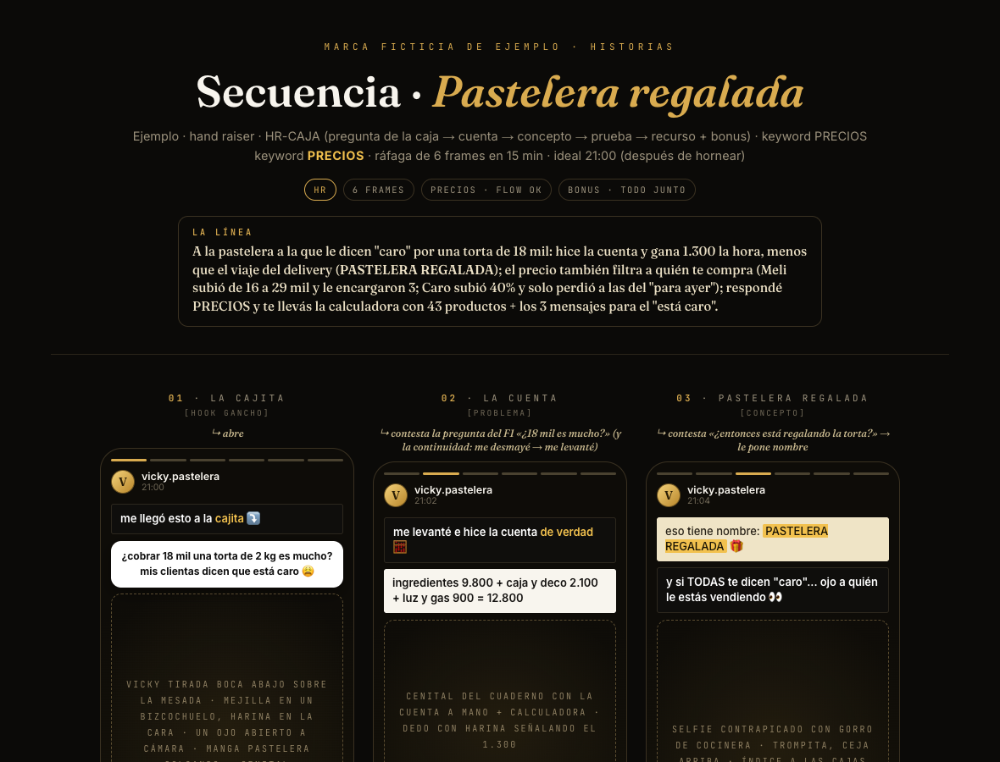
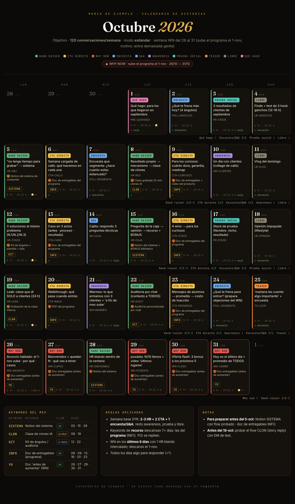

# historias-ig

**Una skill de Claude Code que te dice qué historias de Instagram subir cada día y te las escribe frame por frame.**
La armé estudiando cómo hacen historias las cuentas que más venden con ellas, empezando por @ramiro.cubria.

Hecha por **Agustín Ruppel** · [@agustin.ruppel](https://instagram.com/agustin.ruppel) · armo sistemas de IA para
infoproductores.



---

## Qué hace

- **Calendario del mes o de la semana.** Te dice qué tipo de historia va cada día: hand raiser, CTA, why now,
  encuesta, awareness, prueba social o libre. También fija con qué keyword, qué recurso y en qué ventana de
  urgencia.
- **La secuencia del día, frame por frame.** El texto de cada caja (negra, blanca, crema o amarilla), el visual,
  cómo actuarlo, el sticker, la música, el CTA y lo que tenés que tener listo antes de publicar.
- **Un juez adentro.** Antes de entregarte nada, la secuencia se puntúa contra el estándar de las historias que
  realmente venden. Si no llega a 9/10, se reescribe.
- **Registro.** Le pasás views y respuestas y te dice si estás arriba o abajo del benchmark de ese tipo de
  historia, y qué cambiar la semana siguiente.
- **Revisión.** Le pasás capturas de una secuencia que ya subiste y te dice qué rompió y te la devuelve
  corregida.

Todo sale en `.md` (para copiar a Instagram) y en `.html` (la placa visual, para vos o tu equipo).



## De dónde sale

- **~120 secuencias reales transcriptas frame por frame**, casi todas de @ramiro.cubria y de cuentas que usan su
  método. Están en `references/corpus/` y la skill las usa como ejemplos cada vez que escribe.
- **El método SYK**: cuántos hand raisers, CTAs y why now por semana, y cuándo va cada uno.
- **Stats reales** de historias que explotaron: tasa de respuesta por tipo, qué es bueno y qué es flojo.
- **~60 estructuras con nombre** (HR, CTA, WN, encuestas, awareness), cada una con su molde y su ejemplo real.
- **Un loop de calidad**: la skill generó secuencias, un juez que razona como Ramiro las destrozó, y cada error
  quedó escrito como regla. Esas reglas están en `references/nivel-ramiro.md`.

## Instalación

```bash
git clone https://github.com/<tu-usuario>/historias-ig ~/.claude/skills/historias-ig
```

Necesitás **Claude Code** y **python3**. Si también querés que te saque la captura PNG de cada placa:

```bash
pip install playwright && playwright install chromium
```

## Cómo se usa

Abrí Claude Code en la carpeta de tu proyecto (o la de tu cliente) y pedile:

- `armame el calendario de historias de octubre`
- `qué historias subo hoy`
- `armá la secuencia del jueves: hand raiser con keyword GUIA`
- `revisá esta secuencia` y le pegás las capturas
- `registrá cómo fue la de ayer: 4.100 views, 38 respuestas`

La primera vez te hace unas preguntas, cada una con una respuesta por defecto: qué vendés, qué recursos tenés,
qué casos podés mostrar y tu tono. Con eso arma tu perfil de marca y no vuelve a preguntar. Sirve para varias
marcas: cada proyecto tiene su perfil.

## Qué hay adentro

```
historias-ig/
├── SKILL.md                    el procedimiento (lo que lee Claude)
├── references/
│   ├── nivel-ramiro.md         el estándar de calidad + el juez
│   ├── metodo.md               los 9 tipos de historia y para qué sirve cada uno
│   ├── calendario.md           el motor: qué va cada día, semana y mes
│   ├── estructuras.md          árbol de decisión + estructuras/ (hr · cta · wn · nutrición)
│   ├── copy.md                 banco de hooks, CTAs, escasez, keywords
│   ├── visual.md               cajas, neón, capturas, grabación
│   ├── metricas.md             benchmarks y qué cambiar cuando algo no rinde
│   ├── perfil-marca.md         el onboarding de cada marca
│   ├── plantillas-output.md    los formatos de salida
│   └── corpus/                 las secuencias reales (INDEX.md para buscar)
├── assets/                     plantillas HTML + ejemplos JSON
├── scripts/render.py           arma el HTML y chequea las reglas (lint)
└── examples/                   una secuencia y un calendario de ejemplo
```

## Créditos

El método y los ejemplos no son míos: los estudié y los ordené.

- **Ramiro Cubría / SYK** ([@ramiro.cubria](https://instagram.com/ramiro.cubria)): la mayoría de las secuencias
  del corpus, el método de calendario (hand raiser, CTA, why now) y los Looms sobre CTAs e insight.
- **Alex Carrera**: el documento de estructura de historias (hook gancho → hook resultado → vehículo → CTA).
- Otras cuentas del corpus: @cristiansocial, @mateomaffia, @fiariveraoff, @juanpicrea, @matelezama,
  @agustinbadt, @nahue.urso.
- Frameworks complementarios: Nick Setting, Max Inhouse, SooWei Goh.

El corpus son transcripciones de historias publicadas en abierto, juntadas para estudiar su estructura. Los derechos
de ese contenido son de sus autores. Si sos uno de ellos y querés que saque algo, escribime por
[Instagram](https://instagram.com/agustin.ruppel) y lo saco.

## Sobre mí

Soy Agustín, tengo 21 años y programo desde los 14. Armo sistemas de IA para infoproductores: setters, análisis
de llamadas, CRM, clones de contenido. Esta skill empezó como algo para mis propias historias y terminó siendo
esto.

Si querés que te la adapte a tu negocio, o que te arme el sistema entero, escribime
**"HISTORIAS"** por [Instagram](https://instagram.com/agustin.ruppel).
